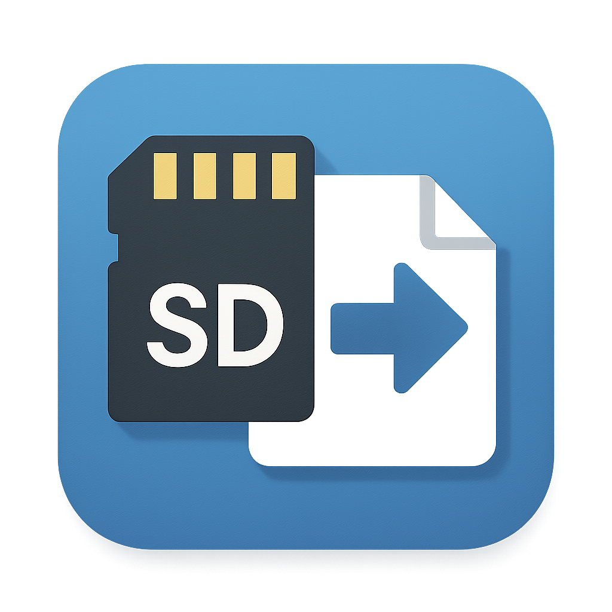

# SD Card Backup Tool | SD卡備份工具

<p align="center">
  
</p>


> A user-friendly tool for backing up files from SD cards to your computer. 
> 一個簡單好用的 SD 卡檔案備份工具，備份至本機磁碟。 

---
開發理念 | Project Purpose

This tool was created out of a personal need: helping my parent — a member of the older generation — enjoy their digital memories without struggling with technology. Tasks like copying photos from an SD card may seem trivial to tech-savvy users, but they can be overwhelming to others. This tool was designed with simplicity and clarity in mind, eliminating unnecessary options that could confuse rather than assist. My goal is to make file backup a pain-free, one-click process — so that everyone, regardless of technical background, can easily preserve their moments. ✨📸🔒

這個工具的開發初衷，來自於幫助我的父母 —— 一群對科技不那麼熟悉的長輩。對我們來說輕而易舉的操作，如從 SD 卡複製照片，對他們而言卻可能是困難重重。我希望透過這個工具，以「極簡易用」為核心設計理念，移除可能造成混淆的選項，讓備份過程盡可能簡單、直覺，幾乎只需一鍵即可完成備份，讓每個人都能輕鬆保存回憶。✨📸🔒

---

## 功能特點 | Features

* 簡單直覽的使用者介面 / Simple and intuitive user interface
* 視覺化磁碟選擇和空間資訊 / Visual drive selection with space information
* 檔案類型偵測（照片、影片、RAW檔案） / File type detection (photos, videos, RAW files)
* **🔥 MTP裝置支援** / **🔥 MTP Device Support**
  * 自動偵測手機和相機 / Automatic detection of phones and cameras
  * 直接從MTP裝置備份 / Direct backup from MTP devices
  * 智慧型檔案類型識別 / Intelligent file type recognition
* 重複檔案偵測和跳過 / Duplicate file detection and skipping
* 多層資料夾結構組織 / Multi-level folder structure organization


## 支援的檔案格式 | Supported File Formats 📷📹📑

### 照片格式 | Photo Formats

* JPEG (.jpg, .jpeg)
* PNG (.png)
* BMP (.bmp)
* GIF (.gif)
* HEIC (.heic)
* WebP (.webp)
* TIFF (.tiff, .tif)

### RAW檔格式 | RAW File Formats

* Canon (.cr2, .cr3, .crw)
* Nikon (.nef)
* Sony (.arw, .sr2)
* Olympus (.orf)
* Panasonic (.rw2)
* Adobe (.dng)
* Fujifilm (.raf)
* Pentax (.pef)
* Generic (.raw)

### 影片格式 | Video Formats

* MP4 (.mp4)
* QuickTime (.mov)
* AVI (.avi)
* Matroska (.mkv)
* AVCHD (.mts, .m2ts)
* Windows Media (.wmv)
* Flash Video (.flv)
* 3GP (.3gp)
* iTunes Video (.m4v)
* MPEG (.mpg, .mpeg)

## 系統需求 | Requirements

### 使用執行檔 | Using the Executable

* Windows 7 或更新版本 / Windows 7 or later
* **推薦 Windows 10/11** / **Recommended Windows 10/11** (for optimal MTP support)

### 從原始碼建置 / 執行 | Building/Running from Source

* Windows 7 或更新版本 / Windows 7 or later
* Python 3.8 或更新版本 / Python 3.8 or later
* 必要的 Python 套件（由建置腳本自動安裝）/ Required Python packages (auto-installed):

  * PyQt5
  * pywin32 (required for MTP support)
  * Pillow
  * pyinstaller (for building)

### MTP裝置支援 | MTP Device Support

* Windows 10/11 推薦 / Windows 10/11 recommended
* 支援的裝置 / Supported devices:
  * Android 手機 / Android phones
  * iOS 裝置 (透過iTunes) / iOS devices (via iTunes)
  * 數位相機 / Digital cameras
  * 其他MTP相容裝置 / Other MTP-compatible devices

## 安裝方式 | Installation 

### 選項 1: 使用執行檔 / Using the Executable

1. 從 [Releases 頁面](https://github.com/markyip/SD-Backup-Tool/releases) 下載最新版 / Download from \[releases]
2. 執行 `SD_Backup_Tool.exe` / Run the executable

### 選項 2: 從原始碼建置 / Building from Source

1. **複製儲存庫 / Clone the repository:**

   ```bash
   git clone https://github.com/markyip/SD-Backup-Tool.git
   cd SD-Backup-Tool
   ```

2. **建立虛擬環境 / Create a virtual environment:**

   ```bash
   python -m venv venv
   ```

3. **啟用虛擬環境 / Activate the virtual environment:**

   ```bash
   # Windows
   venv\Scripts\activate

   # Linux/Mac
   source venv/bin/activate
   ```

4. **安裝依賴項目 / Install dependencies:**

   ```bash
   pip install -r requirements.txt
   ```

5. **使用批次檔建置執行檔 / Build using the batch script:**

   ```bash
   scripts\build_sd_backup_tool.bat

   # 或手動 / Or manually:
   python build_config/build.py
   ```

6. **執行檔將在 `dist` 資料夾中建立 / The executable will be created in the `dist` folder**

### 選項 3: 開發模式執行 / Development Mode

1. 請先依照上述步驟設定環境 / Follow steps 1-4 above
2. 直接使用 Python 執行 / Run directly:

   ```bash
   python main.py
   ```
3. 或使用批次檔 / Or use batch script:

   ```bash
   scripts\run_sd_backup_tool.bat
   scripts\run_sd_backup_tool_conda.bat
   ```

## 使用方式 | Usage

### SD卡備份 | SD Card Backup
1. 啟動應用程式 / Launch the application
2. 插入 SD 卡（會自動偵測並掃描）/ Insert SD card (auto-detected)
3. 選擇目標磁碟機 / Select target drive
4. 點擊「開始備份」/ Click "Start Backup"

### MTP裝置備份 | MTP Device Backup
1. 啟動應用程式 / Launch the application
2. 連接手機或相機到電腦 / Connect phone or camera to computer
3. 裝置會自動偵測並顯示 / Device will be auto-detected and displayed
4. 選擇目標磁碟機 / Select target drive
5. 點擊「開始備份」/ Click "Start Backup"

### 🎯 智慧功能 | Smart Features
* **自動檔案整理** / **Automatic file organization**: 按日期和類型分類 / Organized by date and type
* **重複檔案跳過** / **Duplicate file skipping**: 避免重複備份 / Avoid duplicate backups
* **相機檔案識別** / **Camera file recognition**: 自動識別Sony等品牌相機檔案 / Auto-detect Sony and other camera files

## 自訂語言 | Customizing Language 

1. 開啟 `locales/translations.py` / Open `locales/translations.py`
2. 每行譯文有英文註解說明 / Each line has English reference
3. 修改冒號後的內容 / Edit the content after the colon (:)
4. 儲存並重新建置應用程式 / Save and rebuild the app

## 專案結構 | Project Structure

```
sd_backup_tool/
├── assets/                          # 圖示與資源 / Icons & Assets
│   ├── app_icon.png                # 應用程式圖示 / App icon
│   └── icon.ico                    # Windows 圖示 / Windows icon
├── build_config/                   # 建置設定 / Build scripts
│   ├── build.py                    # 主要建置腳本 / Main build script
│   ├── create_installer.py         # 安裝程式建立 / Installer creation
│   ├── installer.iss               # Inno Setup 設定 / Inno Setup config
│   └── 相片影片備份工具.spec        # PyInstaller 規格 / PyInstaller spec
├── core/                           # 核心模組 / Core logic
│   ├── backup_worker.py            # 備份處理器 (支援MTP) / Backup worker (MTP support)
│   ├── file_scanner.py             # 檔案掃描器 (MTP + 檔案系統) / File scanner (MTP + filesystem)
│   └── sd_detector_fixed.py        # 裝置偵測器 (SD + MTP) / Device detector (SD + MTP)
├── locales/                        # 多語言支援 / Multi-language support
│   ├── translations.py             # 翻譯檔案 / Translation file
│   └── __init__.py                 # 語言管理器 / Language manager
├── scripts/                        # 批次工具 / Batch tools
│   ├── build_sd_backup_tool.bat    # 建置執行檔 / Build executable
│   ├── run_sd_backup_tool.bat      # 開發執行 / Development run
│   └── run_sd_backup_tool_conda.bat # Conda 環境執行 / Conda environment run
├── ui/                             # 使用者介面 / User Interface
│   ├── main_window_enhanced.py     # 主視窗 / Main window
│   └── drive_tile_widget.py        # 磁碟選擇界面 / Drive selection UI
├── main.py                         # 主程式入口 / Entry point
├── requirements.txt                # 依賴清單 / Dependencies
├── PROJECT_STRUCTURE.md            # 專案架構說明 / Project structure docs
└── RELEASE_NOTES.md                # 版本發布記錄 / Release notes
```

### 🔧 核心技術特色 | Core Technical Features

**MTP 裝置整合 | MTP Device Integration**
- Windows COM 介面整合 / Windows COM interface integration
- 多重備份策略與錯誤復原 / Multiple backup strategies with error recovery
- 智慧型檔案類型偵測 / Intelligent file type detection

**檔案組織系統 | File Organization System**
- 自動按日期分類 (Photos_YYYY/MM/DD) / Automatic date-based organization
- 重複檔案偵測與跳過 / Duplicate file detection and skipping
- 相機專用檔案格式支援 / Camera-specific file format support

## 可用批次檔 | Available Scripts 

### `build_sd_backup_tool.bat`

* 建置獨立執行檔 / Build executable
* 自動檢查依賴、輸出至 `dist/` / Automatically checks dependencies and outputs to  `dist/`

### `run_sd_backup_tool.bat`

* 使用 Python 執行應用程式 / Run with standard Python
* 適合開發者使用 / Suitable for developers

### `run_sd_backup_tool_conda.bat`

* 使用 Conda 環境執行 / Run with Conda environment
* 適合進階使用者 / Recommended for advanced users

## 開發者 | Developers 

* **Mark Yip** - Lead Developer
* **Roo** - Co-Developer

## 參與貢獻 | Contributing

1. Fork 儲存庫 / Fork the repository
2. 建立功能分支 / Create a feature branch
3. 修改程式碼 / Make your changes
4. 提交 PR / Submit a pull request

## 疑難排解 | Troubleshooting

### MTP 裝置問題 | MTP Device Issues

**裝置未被偵測 | Device Not Detected**
- 確保 USB 偵錯模式已開啟 (Android) / Ensure USB debugging is enabled (Android)
- 嘗試不同的 USB 連接線 / Try a different USB cable
- 重新啟動應用程式 / Restart the application
- 檢查 Windows 裝置管理員中的 MTP 驅動程式 / Check MTP drivers in Windows Device Manager

**檔案複製失敗 | File Copy Failures**
- 確保裝置有足夠的電量 / Ensure device has sufficient battery
- 檢查目標磁碟機空間 / Check destination drive space
- 暫時關閉防毒軟體 / Temporarily disable antivirus software
- 以系統管理員身分執行 / Run as administrator

**效能問題 | Performance Issues**
- 使用高品質 USB 3.0 連接線 / Use high-quality USB 3.0 cable
- 關閉不必要的應用程式 / Close unnecessary applications
- 確保裝置未進入休眠模式 / Keep device from entering sleep mode

### 一般問題 | General Issues

**建置錯誤 | Build Errors**
- 確保已安裝所有依賴項目 / Ensure all dependencies are installed
- 使用虛擬環境 / Use virtual environment
- 檢查 Python 版本 (需要 3.8+) / Check Python version (requires 3.8+)

## 授權條款 | License

本專案採用 MIT 授權條款 / This project is licensed under the MIT License - see LICENSE
