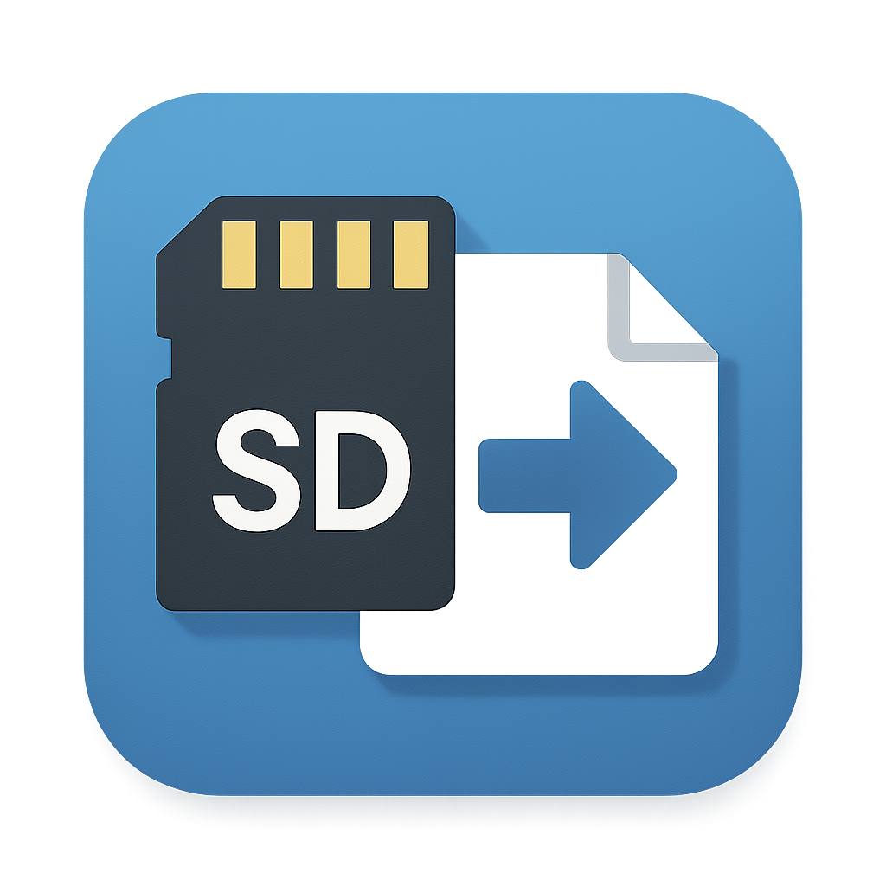

# SD Card Backup Tool | SD卡備份工具

<p align="center">
  
</p>


](https://github.com/markyip/SD-Backup-Tool/releases/latest/download/SD_Backup_Tool.exe)


> A user-friendly tool for backing up files from SD cards to your computer. 
> 一個簡單好用的 SD 卡檔案備份工具

---
This project was born from a personal motivation: to help my parent, who finds modern technology challenging, enjoy their digital memories without stress. While tasks like copying photos from an SD card might feel simple for tech-savvy users, they can be a real hurdle for others. That's why I set out to design a tool that prioritizes simplicity, clarity, and ease of use.

The SD Card Backup Tool eliminates confusing options that often complicate the process rather than improve it. My goal is to provide a one-click solution that makes file backup effortless and accessible for everyone, regardless of age or technical background. To further improve usability, I’ve incorporated visual cues and thoughtful interface elements that enhance readability and guide users intuitively through each step. ✨📸🔒

這個專案係我因應個人需要而開發，希望幫到我爸媽呢類對科技唔太熟嘅上一代，可以輕鬆享受佢哋嘅數碼回憶。對於識用電腦嘅人嚟講，從 SD 卡複製相片可能係好基本，但對長輩或者唔太熟 IT 嘅人，卻可能好唔方便。

所以我設計咗一個以「簡單」、「清晰」同「易用」為重心嘅工具，專登移除啲多餘又可能令人混亂嘅選項，令備份過程變得直觀易明，幾乎一撳就搞掂。為咗令操作更親民，我仲喺介面度加入咗視覺提示同引導元素，幫助用家一步步完成整個流程，就算冇技術背景都可以安心備份珍貴回憶。✨📸🔒

---

## 功能特點 | Features 

* 簡單直覽的使用者介面 / Simple and intuitive user interface
* 視覺化磁碟選擇和空間資訊 / Visual drive selection with space information
* 檔案類型偵測（照片、影片、RAW檔案） / File type detection (photos, videos, RAW files)


## 支援的檔案格式 | Supported File Formats

### 照片格式 | Photo Formats

* JPEG (.jpg, .jpeg)
* PNG (.png)
* BMP (.bmp)
* GIF (.gif)
* HEIC (.heic)
* WebP (.webp)
* TIFF (.tiff, .tif)

### RAW檔格式 | RAW File Formats

* Canon (.cr2, .cr3, .crw)
* Nikon (.nef)
* Sony (.arw, .sr2)
* Olympus (.orf)
* Panasonic (.rw2)
* Adobe (.dng)
* Fujifilm (.raf)
* Pentax (.pef)
* Generic (.raw)

### 影片格式 | Video Formats

* MP4 (.mp4)
* QuickTime (.mov)
* AVI (.avi)
* Matroska (.mkv)
* AVCHD (.mts, .m2ts)
* Windows Media (.wmv)
* Flash Video (.flv)
* 3GP (.3gp)
* iTunes Video (.m4v)
* MPEG (.mpg, .mpeg)

## 系統需求 | Requirements 

### 使用執行檔 | Using the Executable

* Windows 7 或更新版本 / Windows 7 or later

### 從原始碼建置 / 執行 | Building/Running from Source

* Windows 7 或更新版本 / Windows 7 or later
* Python 3.8 或更新版本 / Python 3.8 or later
* 必要的 Python 套件（由建置腳本自動安裝）/ Required Python packages (auto-installed):

  * PyQt5
  * pywin32
  * Pillow
  * pyinstaller (for building)

## 安裝方式 | Installation 

### 選項 1: 使用執行檔 / Using the Executable

1. 從 [Releases 頁面](https://github.com/markyip/SD-Backup-Tool/releases) 下載最新版 / Download from \[releases]
2. 執行 `SD_Backup_Tool.exe` / Run the executable

### 選項 2: 從原始碼建置 / Building from Source

1. **複製儲存庫 / Clone the repository:**

   ```bash
   git clone https://github.com/markyip/SD-Backup-Tool.git
   cd SD-Backup-Tool
   ```

2. **建立虛擬環境 / Create a virtual environment:**

   ```bash
   python -m venv venv
   ```

3. **啟用虛擬環境 / Activate the virtual environment:**

   ```bash
   # Windows
   venv\Scripts\activate

   # Linux/Mac
   source venv/bin/activate
   ```

4. **安裝依賴項目 / Install dependencies:**

   ```bash
   pip install -r requirements.txt
   ```

5. **使用批次檔建置執行檔 / Build using the batch script:**

   ```bash
   scripts\build_sd_backup_tool.bat

   # 或手動 / Or manually:
   python build_config/build.py
   ```

6. **執行檔將在 `dist` 資料夾中建立 / The executable will be created in the `dist` folder**

### 選項 3: 開發模式執行 / Development Mode

1. 請先依照上述步驟設定環境 / Follow steps 1-4 above
2. 直接使用 Python 執行 / Run directly:

   ```bash
   python main.py
   ```
3. 或使用批次檔 / Or use batch script:

   ```bash
   scripts\run_sd_backup_tool.bat
   scripts\run_sd_backup_tool_conda.bat
   ```

## 使用方式 | Usage 

1. 啟動應用程式 / Launch the application
2. 插入 SD 卡（會自動偵測並掃描）/ Insert SD card (auto-detected)
3. 選擇目標磁碟機 / Select target drive
4. 點擊「開始備份」/ Click "Start Backup"

## 自訂語言 | Customizing Language 

1. 開啟 `locales/translations.py` / Open `locales/translations.py`
2. 每行譯文有英文註解說明 / Each line has English reference
3. 修改冒號後的內容 / Edit the content after the colon (:)
4. 儲存並重新建置應用程式 / Save and rebuild the app

## 專案結構 | Project Structure 

```
sd_backup_tool/
├── assets/                          # 圖示 / Icons
├── build_config/                   # 建置設定 / Build scripts
│   ├── build.py
│   ├── create_installer.py
│   └── installer.iss
├── core/                           # 核心模組 / Core logic
├── locales/                        # 語言檔案 / Translations
│   ├── translations.py
│   └── __init__.py
├── scripts/                        # 批次工具 / Batch tools
│   ├── build_sd_backup_tool.bat
│   ├── run_sd_backup_tool.bat
│   └── run_sd_backup_tool_conda.bat
├── ui/                             # 使用者介面 / UI
├── main.py                         # 主程式入口 / Entry point
└── requirements.txt                # 依賴清單 / Dependencies
```

## 可用批次檔 | Available Scripts 

### `build_sd_backup_tool.bat`

* 建置獨立執行檔 / Build executable
* 自動檢查依賴、輸出至 `dist/` / Automatically checks dependencies and outputs to  `dist/`

### `run_sd_backup_tool.bat`

* 使用 Python 執行應用程式 / Run with standard Python
* 適合開發者使用 / Suitable for developers

### `run_sd_backup_tool_conda.bat`

* 使用 Conda 環境執行 / Run with Conda environment
* 適合進階使用者 / Recommended for advanced users

## 開發者 | Developers 

* **Mark Yip** - Lead Developer
* **Roo** - Co-Developer

## 參與貢獻 | Contributing 

1. Fork 儲存庫 / Fork the repository
2. 建立功能分支 / Create a feature branch
3. 修改程式碼 / Make your changes
4. 提交 PR / Submit a pull request

## 授權條款 | License 

本專案採用 MIT 授權條款 / This project is licensed under the MIT License - see LICENSE
